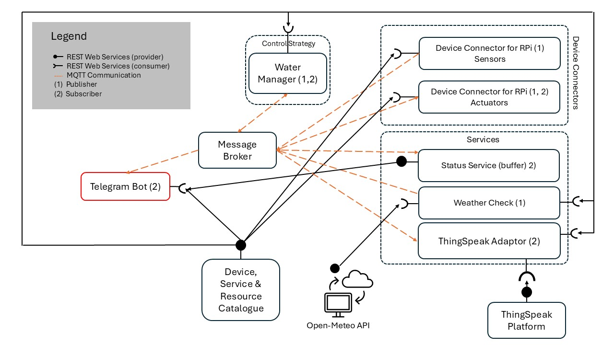

# Smart Precision Irrigation System - Technical Documentation

## Table of Contents
1. [System Overview](#1-system-overview)
2. [Architecture Diagram](#2-architecture-diagram)
3. [Communication Protocols](#3-communication-protocols)
4. [SenML Message Format](#4-senml-message-format)
5. [Components](#5-components)
6. [Smart Irrigation Logic](#6-smart-irrigation-logic)
7. [Data Flow](#7-data-flow)
8. [Configuration](#8-configuration)
9. [MQTT Topics](#9-mqtt-topics)
10. [REST API Endpoints](#10-rest-api-endpoints)

---

## 1. System Overview

The **Smart Precision Irrigation System** is an IoT-based microservices platform for smart agriculture using **REST APIs** and **MQTT messaging**.

### Key Features
| Feature | Description |
|---------|-------------|
| Smart Water Management | Irrigation based on crop type and moisture threshold |
| Weather-Aware | Skips irrigation during rain (>5mm) or frost (<2C) |
| Multi-Garden Support | Multiple gardens with independent field configurations |
| Auto-Discovery | Water Manager discovers new devices every 60 seconds |
| Resource Tracking | Monitors water consumption per irrigation cycle |
| Cloud Analytics | ThingSpeak integration for visualization |
| Telegram Alerts | Real-time weather notifications |

### System Hierarchy
```
System
-- garden_1 (Main Garden)
   -- field_1 (tomato, 100m2)
   -- field_2 (lettuce, 50m2)
-- garden_2 (Secondary Garden)
   -- field_1 (wheat, 200m2)
```

### Naming Conventions
- **Device ID**: `{type}_{garden_id}_{field_id}_{counter:03d}` (e.g., `sensor_garden_1_field_1_001`)
- **MQTT Topic**: `smart_irrigation/farm/{garden_id}/{field_id}/{data_type}`

---

## 2. Architecture Diagram



### Component Overview

| Component | Role | Protocol |
|-----------|------|----------|
| **Catalogue** (port 8080) | Central registry for devices and configuration | REST Provider |
| **Status Service** (port 9090) | Caches device states, provides query API | REST + MQTT Sub |
| **Water Manager** | Brain - triggers irrigation based on moisture/weather | MQTT Pub/Sub + REST |
| **Weather Check** | Polls Open-Meteo, publishes rain/frost alerts | MQTT Pub + REST |
| **Telegram Bot** | Forwards weather alerts to users | MQTT Sub + REST |
| **ThingSpeak Adaptor** | Uploads sensor data to cloud | MQTT Sub + REST |
| **Sensor Nodes** | Publish soil moisture and temperature | MQTT Pub + REST |
| **Actuator Nodes** | Control solenoid valves, track water usage | MQTT Pub/Sub + REST |

---

## 3. Communication Protocols

### REST vs MQTT Usage

| Use Case | Protocol | Reason |
|----------|----------|--------|
| Configuration/Bootstrap | REST | Request-response pattern |
| Device Registration | REST | Reliable, gets assigned ID |
| Sensor Data | MQTT (QoS 0) | High frequency, pub/sub |
| Valve Commands | MQTT (QoS 1) | Must be delivered |
| Weather Alerts | MQTT (QoS 1) | Critical notifications |

### QoS Levels
- **QoS 0**: Sensor data (loss acceptable)
- **QoS 1**: Alerts and commands (guaranteed delivery)

---

## 4. SenML Message Format

All MQTT messages use **SenML** (Sensor Markup Language) format.

### Fields
| Field | Description | Example |
|-------|-------------|---------|
| `bn` | Base Name (device ID) | `"sensor_garden_1_field_1_001"` |
| `n` | Measurement name | `"soil_moisture"` |
| `t` | Timestamp (Unix epoch) | `1703419200.0` |
| `v` | Numeric value | `25.5` |
| `vs` | String value | `"OPEN"` |

### Examples

**Sensor Data:**
```json
[
    {"bn": "sensor_garden_1_field_1_001", "n": "soil_moisture", "t": 1703419200.0, "v": 25.5},
    {"bn": "sensor_garden_1_field_1_001", "n": "temperature", "t": 1703419200.0, "v": 22.1}
]
```

**Actuator Status:**
```json
[{"bn": "actuator_garden_1_field_1_001", "n": "valve_status", "t": 1703419200.0, "vs": "OPEN"}]
```

**Resource Usage:**
```json
[
    {"bn": "actuator_garden_1_field_1_001", "n": "water_liters", "t": 1703419200.0, "v": 10.5},
    {"bn": "actuator_garden_1_field_1_001", "n": "duration_sec", "t": 1703419200.0, "v": 120.0}
]
```

---

## 5. Components

### 5.1 Device Classes (Inheritance)

```
BaseDevice (registration, bootstrap, heartbeat, MQTT)
    -- BaseSensor -> SensorNode (soil moisture + temperature)
    -- BaseActuator -> ActuatorNode (valve control)
```

### 5.2 Device Self-Registration

Devices register via POST without an ID; the Catalogue assigns one:

```
Device -> POST /devices {"type": "sensor", "garden_id": "garden_1", "field_id": "field_1"}
Catalogue -> {"status": "registered", "id": "sensor_garden_1_field_1_001", "topics": {...}}
```

### 5.3 Services Summary

| Service | File | Key Responsibilities |
|---------|------|---------------------|
| Catalogue | `src/services/catalogue/service.py` | CRUD for devices, gardens, configuration |
| Status | `src/services/status/service.py` | Cache device states, merge sensor readings |
| Water Manager | `src/services/water_manager/service.py` | Irrigation decisions, valve commands |
| Weather Check | `src/services/weather_check/service.py` | Poll Open-Meteo, publish alerts |
| Telegram Bot | `src/services/telegram_bot/service.py` | Forward alerts to users |
| ThingSpeak | `src/services/thingspeak_adaptor/service.py` | Upload data to cloud |

---

## 6. Smart Irrigation Logic

### Decision Flow
```
IF moisture < threshold AND NOT rain_alert AND NOT frost_alert THEN
    duration = DURATIONS[crop_type]
    OPEN valve for {duration} seconds
ELSE IF weather alert active THEN
    SKIP irrigation
ELSE
    No action (moisture OK)
```

### Crop-Based Durations

| Crop | Duration |
|------|----------|
| Tomato | 600s (10 min) |
| Corn | 480s (8 min) |
| Lettuce | 300s (5 min) |
| Wheat | 240s (4 min) |
| Default | 300s (5 min) |

### Weather Alerts
- **Rain Alert**: Irrigation skipped if rain > 5mm predicted
- **Frost Alert**: Irrigation skipped if temperature < 2C forecast

---

## 7. Data Flow

### Startup Sequence
1. Catalogue starts (port 8080)
2. Status Service starts (port 9090)
3. Other services bootstrap from Catalogue
4. Devices self-register, receive IDs and topics
5. System enters operational mode

### Irrigation Flow
```
Sensor -> MQTT (moisture) -> Water Manager -> MQTT (command) -> Actuator
                                ^
Weather Check -> MQTT (alerts) -+
```

---

## 8. Configuration

All configuration is centralized in `config/system_config.json`:

```json
{
    "broker": {"address": "broker.hivemq.com", "port": 1883},
    "services": {
        "catalogue": {"host": "localhost", "port": 8080},
        "status": {"host": "localhost", "port": 9090}
    },
    "settings": {
        "moisture_threshold": 30.0,
        "rain_threshold_mm": 5.0,
        "frost_threshold_c": 2.0
    },
    "gardens": {
        "garden_1": {
            "fields": {
                "field_1": {"crop_type": "tomato", "field_size_m2": 100, "flow_rate_lpm": 20.0}
            }
        }
    }
}
```

---

## 9. MQTT Topics

| Topic Pattern | Publisher | Subscriber | Purpose |
|---------------|-----------|------------|---------|
| `smart_irrigation/farm/{garden}/{field}/soil_moisture` | Sensor | Water Manager, Status, ThingSpeak | Soil data |
| `smart_irrigation/farm/{garden}/{field}/temperature` | Sensor | Status, ThingSpeak | Temperature |
| `smart_irrigation/farm/{garden}/{field}/valve_cmd` | Water Manager | Actuator | Commands |
| `smart_irrigation/farm/{garden}/{field}/valve_status` | Actuator | Status | Valve state |
| `smart_irrigation/weather/alert` | Weather Check | Water Manager, Telegram | Rain alert |
| `smart_irrigation/weather/frost` | Weather Check | Water Manager, Telegram | Frost alert |
| `smart_irrigation/irrigation/usage` | Actuator | ThingSpeak | Water consumption |

---

## 10. REST API Endpoints

### Catalogue Service (port 8080)

| Method | Endpoint | Description |
|--------|----------|-------------|
| GET | `/` | Full configuration |
| GET | `/devices` | List all devices |
| POST | `/devices` | Register device (ID auto-assigned) |
| PUT | `/devices/{id}` | Update device |
| DELETE | `/devices/{id}` | Remove device |
| GET | `/gardens` | List all gardens |
| POST | `/gardens` | Add new garden |

### Status Service (port 9090)

| Method | Endpoint | Description |
|--------|----------|-------------|
| GET | `/status` | All cached device states |
| GET | `/status/{device_id}` | Specific device state |

---

## Summary

The Smart Precision Irrigation System demonstrates:

- **REST for Configuration**: Catalogue provides central registry
- **MQTT for Real-time**: Efficient pub/sub with SenML format
- **Microservices Pattern**: Single responsibility per service
- **Dynamic Registration**: Devices get auto-assigned IDs
- **Weather-Aware Control**: Automatic irrigation suspension
- **Multi-Garden Support**: Scalable architecture

---

*Document Version: 2.2 | Last Updated: January 2026*
